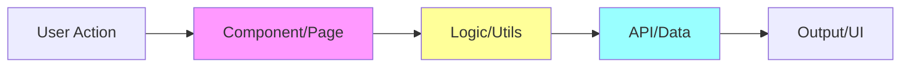

# Workflow — Bug Finder

Méthodologie systématique pour diagnostiquer et résoudre les bugs de manière efficace et documentée.

## Phase 1: Compréhension du problème

### Étape 1: Analyse initiale
```bash
# Recueillir les informations de base
echo "=== BUG REPORT ANALYSIS ==="
echo "Description: [USER_DESCRIPTION]"
echo "Environment: $(node --version) / $(pnpm --version)"
echo "Branch: $(git branch --show-current)"
echo "Last commit: $(git log -1 --oneline)"
```

### Étape 2: Reproduction du bug
- [ ] **Reproduire le bug** localement avec les étapes exactes
- [ ] **Documenter le comportement attendu** vs observé
- [ ] **Identifier les conditions** qui déclenchent le problème
- [ ] **Tester sur différents environnements** (dev/build/preview)

### Étape 3: Résumé avec vos propres mots
*"Le bug se manifeste quand [CONDITION] et provoque [COMPORTEMENT] au lieu de [ATTENDU]. Impact: [IMPACT] sur [FONCTIONNALITÉ]."*

## Phase 2: Investigation technique

### Étape 4: Cartographie des flux


### Étape 5: Analyse du code source
```bash
# Identifier les fichiers pertinents
echo "=== RELEVANT FILES ==="
grep -r "KEYWORD_FROM_ERROR" src/ --include="*.ts" --include="*.astro" | head -10

# Analyser les logs d'erreur
echo "=== ERROR ANALYSIS ==="
pnpm dev 2>&1 | grep -E "error|Error|exception" | tail -20

# Vérifier les types TypeScript
echo "=== TYPE CHECK ==="
pnpm typecheck 2>&1 | grep -A 3 -B 3 "error"
```

### Étape 6: Hypothèses de causes racines

**Top 3 des causes potentielles:**

1. **[CAUSE_1]** - Confiance: [X]%
   - *Symptômes:* [Description]
   - *Zone d'impact:* `src/path/to/file.ts:XX`
   - *Tests rapides:* [Commandes de vérification]

2. **[CAUSE_2]** - Confiance: [Y]%
   - *Symptômes:* [Description]
   - *Zone d'impact:* `src/path/to/file.ts:XX`
   - *Tests rapides:* [Commandes de vérification]

3. **[CAUSE_3]** - Confiance: [Z]%
   - *Symptômes:* [Description]
   - *Zone d'impact:* `src/path/to/file.ts:XX`
   - *Tests rapides:* [Commandes de vérification]

**⏸️ ATTENDRE CONFIRMATION UTILISATEUR avant de continuer**

## Phase 3: Résolution

### Étape 7: Plan de correction (après validation)

**Top 3 approches de résolution:**

1. **[SOLUTION_1] - Recommandée** ⭐
   - *Effort:* [XS/S/M/L/XL] 
   - *Risque:* [Faible/Moyen/Élevé]
   - *Étapes:* [Détailler les actions]
   - *Tests requis:* [Liste des tests]

2. **[SOLUTION_2] - Alternative**
   - *Effort:* [XS/S/M/L/XL]
   - *Risque:* [Faible/Moyen/Élevé] 
   - *Étapes:* [Détailler les actions]
   - *Tests requis:* [Liste des tests]

3. **[SOLUTION_3] - Workaround**
   - *Effort:* [XS/S/M/L/XL]
   - *Risque:* [Faible/Moyen/Élevé]
   - *Étapes:* [Détailler les actions]
   - *Tests requis:* [Liste des tests]

**⏸️ ATTENDRE CONFIRMATION UTILISATEUR avant de procéder à l'implémentation**

## Phase 4: Implémentation et validation

### Étape 8: Application du fix
```bash
# Créer une branche dédiée
git checkout -b fix/[BUG_DESCRIPTION]

# Appliquer les changements
echo "=== IMPLEMENTATION ==="
# [Commandes spécifiques selon la solution choisie]

# Tests de validation
echo "=== VALIDATION ==="
pnpm typecheck
pnpm lint
pnpm test
```

### Étape 9: Tests de régression
```bash
# Vérifier que le bug est corrigé
echo "=== BUG FIX VALIDATION ==="
# [Étapes pour reproduire le scénario initial]

# Tests de non-régression  
echo "=== REGRESSION TESTS ==="
pnpm test
pnpm build
pnpm preview

# Tests manuels des fonctionnalités connexes
echo "=== MANUAL TESTING ==="
# [Liste des cas à tester manuellement]
```

### Étape 10: Documentation et suivi
```bash
# Commit avec message descriptif
git add .
git commit -m "fix(scope): [DESCRIPTION]

- Root cause: [CAUSE_IDENTIFIEE]
- Solution: [SOLUTION_APPLIQUEE]  
- Tests: [TESTS_AJOUTES]

Fixes #[ISSUE_NUMBER]"

# Mise à jour de la documentation si nécessaire
echo "=== DOCUMENTATION UPDATE ==="
# Mettre à jour CLAUDE.md, README, ou documentation pertinente
```

## Checklist de validation finale
- [ ] Bug reproduit et compris
- [ ] Cause racine identifiée avec confiance
- [ ] Solution implémentée et testée
- [ ] Tests de régression passent
- [ ] Code review effectuée (si applicable)
- [ ] Documentation mise à jour
- [ ] Commit avec message descriptif
- [ ] Issue fermée avec référence

## Templates de sortie

### Diagnostic Report
```markdown
# Bug Analysis - [TITLE]

## Problem Summary
[DESCRIPTION_EN_PROPRES_MOTS]

## Root Cause
**[CAUSE_PRINCIPALE]** - File: `[FICHIER]:[LIGNE]`

## Solution Applied  
[DESCRIPTION_SOLUTION]

## Test Plan
- [X] Unit tests pass
- [X] Integration tests pass  
- [X] Manual testing completed
- [X] No regression detected

## Files Changed
- `[FICHIER_1]` - [DESCRIPTION_CHANGEMENT]
- `[FICHIER_2]` - [DESCRIPTION_CHANGEMENT]
```
